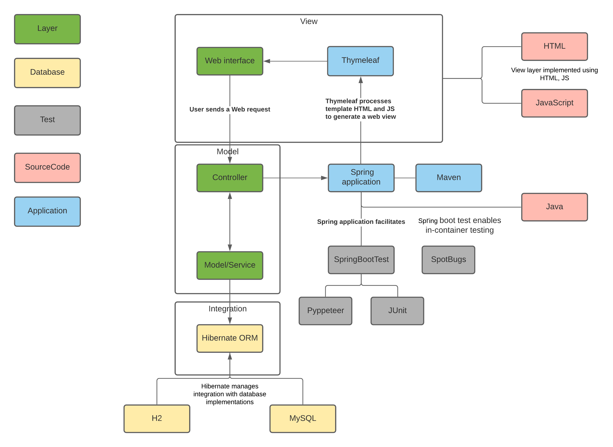
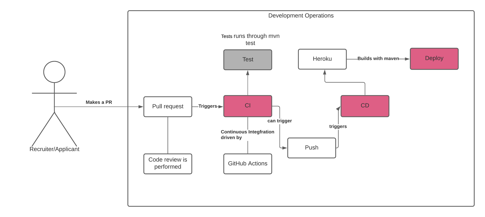

# The Green Garden Recruitment Application

This application was developed as part of the Royal Institute of Technology KTH course IV1201 - Design of Global Applications.

It serves as system handling recruitment applications and distinguish between two types of users: 
- applicants which applies for a position within the company owning the system 
- recruiters which manages applications

Applicants can log in and specify their competences from a given list, their experience in form of years as well as the time periods which they are available for work.
Recruiters can in addition to what a normal applicant can do, also search for applications entered by system users based on competence, availability periods and names. 

## Tools

The following software tools where used when developing the application:

- Version control (Git)
- Project management (Maven)
- Test (Springboot Test, JUnit, Selenium)
- Static analysis (Spotbugs)
- Containerization (Docker?)
- Continous integration (....)
- Cloud runtime (Heroku)
- IDE (Jetbrains IntelliJ Ultimate)

## Frameworks

The following frameworks are used in the application:

- Java Servlets
- Spring core technologies, in particular the IoC container
- Spring Boot
- Spring Web MVC
- Thymeleaf
- Spring Data (Commons and JPA)

## Architecture

The image below shows the architectural layout of the application as well as the DevOps flow

 
 

  

 
 

 
 

  

 
 

## Getting Started

The development was performed in Microsoft Windows and if another operating system is used there is no guarantee that the following steps will set up a working application.

1. Download the project source code.
2. Since the application was developed using the Intellij Ultimate IDEA it is recommended to download and install it. This can be done via this link [link](https://www.jetbrains.com/idea/). The community version can likely be used but there will probably be a need for adding plugins not existing originally.
3. Open up the downloaded project in IntelliJ...
